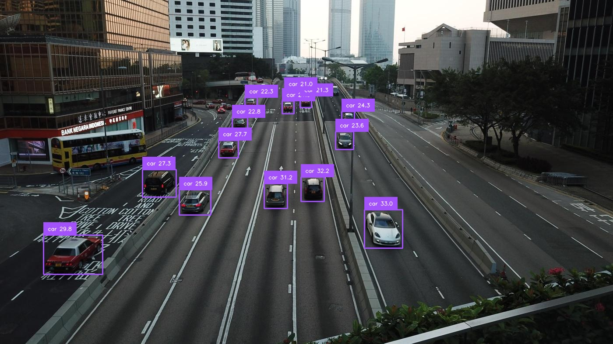

# Grounding DINO End-to-End Inference with OpenVINO™

This document provides instructions on how to set up and run the Grounding DINO object detection model using the OpenVINO™ toolkit. The process includes downloading the necessary pre-trained models, converting them to the OpenVINO Intermediate Representation (IR) format, and finally, running inference on sample images.

This project supports two OpenVINO model conversion and inference modes:
- **E2E (End-to-End) Mode**: Export the entire GroundingDINO-Swin-B as a single IR model for efficient inference on a single device.
- **Pipeline Mode**: Split GroundingDINO-Swin-B into multiple submodules (Language, Visual, Transformer), export each as an IR model, and build a pipeline for distributed/multi-XPU deployment and optimization.

| Mode      | Features / Use Cases                                 |
|-----------|-----------------------------------------------------|
| E2E       | Convert to 1 single model (OV IR) , efficient, suitable for single device    |
| Pipeline  | Split into **language** / **vision** / **transformer** 3 modules, suitable for XPU distributed/heterogeneous deployment |

---

## Prerequisites

Before you begin, ensure you have Python installed. 
Then, install all the required Python packages by running the following command in your terminal:

Reference install Doc: [MMDetection Get Started](https://mmdetection.readthedocs.io/en/latest/get_started.html)
```bash
# Install requirements
pip install -r requirements.txt

# Install MMEngine and MMCV using MIM.
pip install -U openmim
mim install mmengine
mim install "mmcv>=2.0.0"

# Install MMDetection
cd OpenVINO-ONNX-mmdetection
pip install -v -e .
```

## Step-by-Step Guide

The end-to-end process is divided into three main steps:

### Step 1: Download Pre-trained Models

First, you need to download the required models: the `bert-base-uncased` language model and the pre-trained Grounding DINO weights (`.pth` file).

A helper script is provided to automate this process. Run it from your terminal:

```bash
python HF_model_download.py
```

This script will download and save the models into the appropriate subdirectories within the `models/` folder. It will automatically skip the download if the files already exist.

### Step 2: Convert Model to OpenVINO™ Format

Once the models are downloaded, the next step is to convert the PyTorch-based Grounding DINO model into the OpenVINO™ Intermediate Representation (IR) format (`.xml` and `.bin`). This conversion enables optimized inference on Intel hardware.

This script will first export the model to ONNX format and then convert the ONNX model to OpenVINO IR. The resulting files will be saved in the `./models/IR_model/` directory by default.

#### (A) E2E: Export the entire model as a single IR

Run the conversion script, export the model to ONNX format and then convert the ONNX model to OpenVINO IR.:

```bash
python ov_convert_groundingdino_e2e.py
```


#### (B) Pipeline: Export **language** / **vision** / **transformer** submodules as separate IRs

To split the model and export each submodule as OpenVINO IR models for language, visual, and transformer submodules in `./models/IR_model/`.

```bash
python ov_convert_groundingdino_pipeline.py
```


---
### Step 3: OV Run Inference Pipeline

Below is an example of the inference result using the provided model and scripts on `large_image.jpg`:

With the OpenVINO model ready, you can now run inference on your images.

#### (A) OV E2E Inference
Execute the inference script with the following command:

```bash
python ov_infer_e2e.py \
    --images path/to/image_or_dir \
    --prompt "car" \
    --outdir ./outputs
```

The script will use the converted OpenVINO model to perform object detection based on a text prompt. You can customize the inference by modifying the command-line arguments:

-   `--images`: Path to the input image or directory. (Default: `../demo/large_image.jpg`)
-   `--prompt`: Text prompt describing the object to detect. (Default: `car`)
-   `--model`: Path to the OpenVINO model (`.xml` file). (Default: `./models/IR_model/gdino_swinb_800_1333.xml`)
-   `--outdir`: Directory to save the output image with bounding boxes. (Default: `./outputs`)
-   `--threshold`: Confidence threshold for detections. (Default: `0.1`)

For example, to detect a 'person' in a different image:
```bash
python ov_infer_e2e.py --images /path/to/your/image.jpg --prompt "a person"
```

The output image, with detected objects highlighted, will be saved in the directory specified by `--outdir`.

#### (B) OV Pipeline Inference

To run inference using the OV pipeline :

```bash
python ov_infer_pipeline.py \
    --images path/to/image_or_dir \
    --prompt "car" \
    --outdir ./outputs \
    --language_model models/IR_model/gdino_swinb_800_1333_language.xml \
    --visual_model models/IR_model/gdino_swinb_800_1333_visual.xml \
    --transformer_model models/IR_model/gdino_swinb_800_1333_transformer.xml
```

The script supports the following command-line arguments:

-   `--images`: Path to the input image or directory. (Default: `../demo/large_image.jpg`)
-   `--prompt`: Text prompt describing the object to detect. (Default: `car`)
-   `--outdir`: Directory to save the output images with bounding boxes. (Default: `./outputs`)
-   `--language_model`: Path to the exported language IR model. (Default: `./models/IR_model/gdino_swinb_800_1333_language.xml`)
-   `--visual_model`: Path to the exported visual IR model. (Default: `./models/IR_model/gdino_swinb_800_1333_visual.xml`)
-   `--transformer_model`: Path to the exported transformer IR model. (Default: `./models/IR_model/gdino_swinb_800_1333_transformer.xml`)
-   `--threshold`: Confidence threshold for detections. (Default: `0.1`)

You can specify each submodule IR path for flexible deployment. Results will be saved to the output directory.

---

### OpenVINO Inference Result



The image above shows the detection results generated by the OpenVINO E2E or Pipeline inference script.

