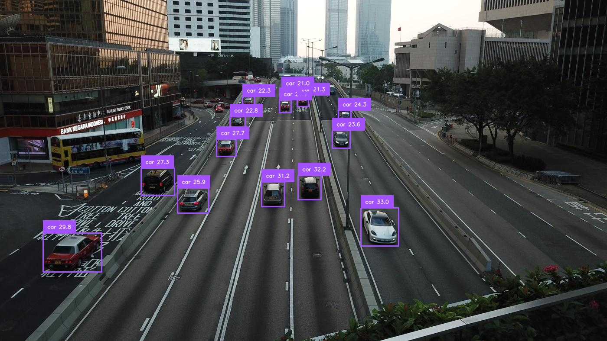

# 基于 OpenVINO™ 的 Grounding DINO 端到端推理（中文版）

本文档介绍如何使用 OpenVINO™ 工具包配置并运行 Grounding DINO 目标检测模型。流程包括：下载所需的预训练模型、将其转换为 OpenVINO IR 格式，并在样例图片上进行推理。

本项目支持两种 OpenVINO 模型转换与推理模式：
- **E2E（端到端）模式**：将 GroundingDINO-Swin-B 整体导出为单一 IR 模型，适合单设备高效推理。
- **Pipeline（流水线/分布式）模式**：将 GroundingDINO-Swin-B 拆分为 Language、Visual、Transformer 三个子模块，分别导出为 IR 模型，便于 XPU 分布式/异构部署与优化。

| 模式      | 特点/适用场景                                   |
|-----------|-----------------------------------------------|
| E2E       | 转为单一 OV IR 模型，高效，适合单设备           |
| Pipeline  | 拆分为 language/vision/transformer 三模块，适合 XPU 分布式/异构部署 |

---

## 环境准备

请确保已安装 Python。然后在终端中运行以下命令安装所有依赖：

参考安装文档：[MMDetection Get Started](https://mmdetection.readthedocs.io/zh_CN/latest/get_started.html)
```bash
# 安装依赖
pip install -r requirements.txt

# 使用 MIM 安装 MMEngine 和 MMCV
pip install -U openmim
mim install mmengine
mim install "mmcv>=2.0.0"

# 安装 MMDetection
cd OpenVINO-ONNX-mmdetection
pip install -v -e .
```

## 步骤详解

整体流程分为三步：

### 步骤1：下载预训练模型

需下载 `bert-base-uncased` 分词器和 Grounding DINO 预训练权重（.pth 文件）。

可使用自动化脚本一键下载：

```bash
python HF_model_download.py
```

模型将自动保存到 `models/` 子目录，若已存在则跳过。

### 步骤2：模型转换为 OpenVINO™ 格式

下载好模型后，下一步是将 PyTorch 格式的 Grounding DINO 转换为 OpenVINO IR 格式（.xml 和 .bin），以便在 Intel 硬件上高效推理。

该脚本会先导出 ONNX，再转换为 OpenVINO IR，默认输出到 `./models/IR_model/` 目录。

#### （A）E2E：整体导出为单一 IR

运行如下脚本：

```bash
python ov_convert_groundingdino_e2e.py
```

#### （B）Pipeline：拆分 language/vision/transformer 子模块分别导出 IR

运行如下脚本，将模型拆分为 language、visual、transformer 三个子模块，分别导出 IR 文件到 `./models/IR_model/` 目录：

```bash
python ov_convert_groundingdino_pipeline.py
```

---
### 步骤3：OV 推理流程

下图为使用提供的模型和脚本在 `large_image.jpg` 上的推理结果示例：

模型准备好后，可直接对图片进行推理。

#### （A）OV E2E 推理

执行推理脚本：

```bash
python ov_infer_e2e.py \
    --images path/to/image_or_dir \
    --prompt "car" \
    --outdir ./outputs
```

常用参数说明：
-   `--images`：输入图片或目录路径（默认：`../demo/large_image.jpg`）
-   `--prompt`：检测目标的文本描述（默认：`car`）
-   `--model`：OpenVINO 模型路径（默认：`./models/IR_model/gdino_swinb_800_1333.xml`）
-   `--outdir`：输出图片保存目录（默认：`./outputs`）
-   `--threshold`：置信度阈值（默认：`0.1`）

例如，检测"person"目标：
```bash
python ov_infer_e2e.py --images /path/to/your/image.jpg --prompt "a person"
```

推理结果图片会自动保存到 `--outdir` 指定目录。

#### （B）OV Pipeline 推理

如需使用 OV pipeline 进行推理：

```bash
python ov_infer_pipeline.py \
    --images path/to/image_or_dir \
    --prompt "car" \
    --outdir ./outputs \
    --language_model models/IR_model/gdino_swinb_800_1333_language.xml \
    --visual_model models/IR_model/gdino_swinb_800_1333_visual.xml \
    --transformer_model models/IR_model/gdino_swinb_800_1333_transformer.xml
```

脚本支持以下命令行参数：

-   `--images`：输入图片或目录路径（默认：`../demo/large_image.jpg`）
-   `--prompt`：检测目标的文本描述（默认：`car`）
-   `--outdir`：输出图片保存目录（默认：`./outputs`）
-   `--language_model`：language IR 模型路径（默认：`./models/IR_model/gdino_swinb_800_1333_language.xml`）
-   `--visual_model`：visual IR 模型路径（默认：`./models/IR_model/gdino_swinb_800_1333_visual.xml`）
-   `--transformer_model`：transformer IR 模型路径（默认：`./models/IR_model/gdino_swinb_800_1333_transformer.xml`）
-   `--threshold`：置信度阈值（默认：`0.1`）

可灵活指定各子模块 IR 路径，结果自动保存到输出目录。

---

### OpenVINO 推理结果展示



如需更多自定义用法或参数说明，请查阅各脚本源码或联系开发者。 